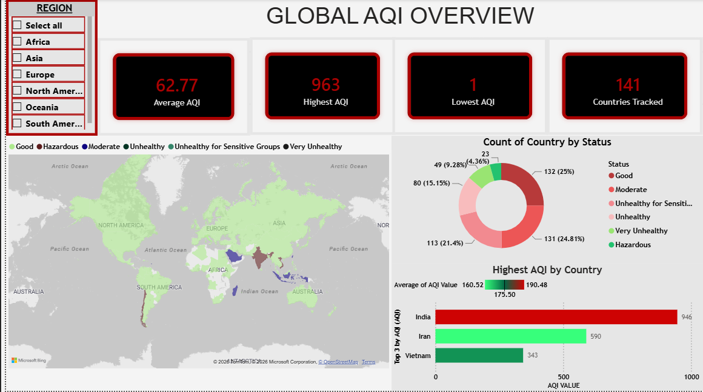
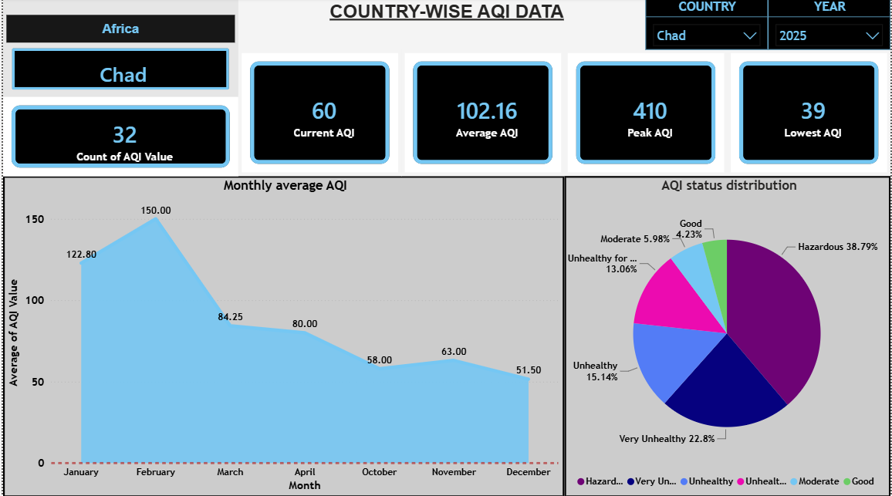
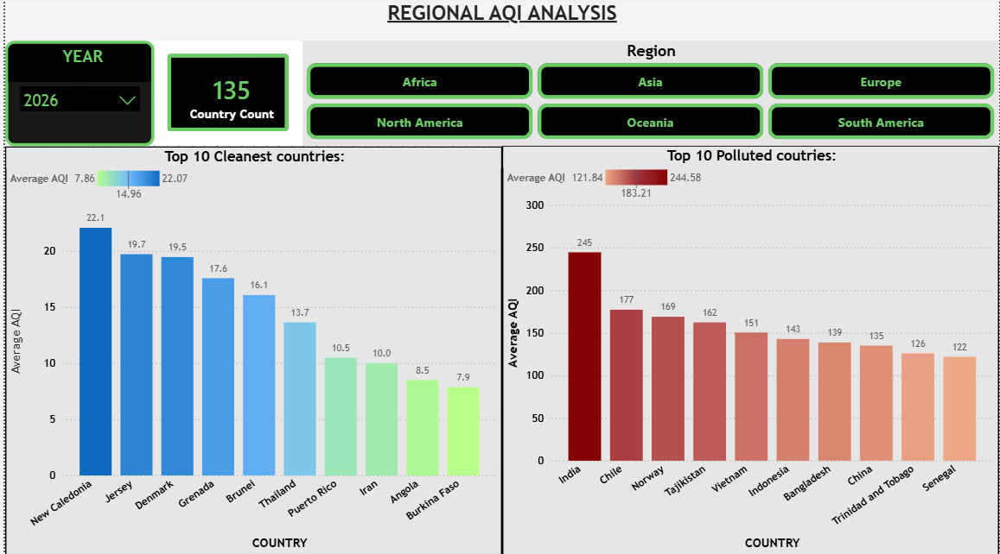
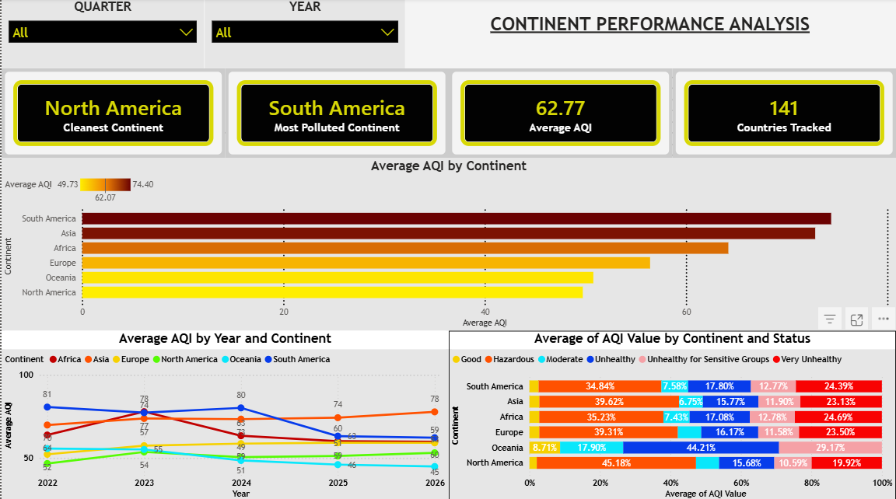

# 🌍 Global Air Quality Analytics Dashboard

An interactive **Power BI Business Intelligence Dashboard** built to analyze worldwide **Air Quality Index (AQI)** trends across **141 countries**, multiple continents, and several years. This project transforms raw environmental data into actionable insights using interactive visualizations, DAX measures, and analytics-focused reporting.

---

# 📊 Dashboard Preview

## 🌎 Global AQI Overview



### Highlights
- Interactive world map
- Average AQI KPI
- Highest AQI KPI
- Lowest AQI KPI
- Total Countries Tracked
- AQI Status Distribution
- Top 3 Most Polluted Countries

---

## 🌍 Country-wise AQI Analysis



### Highlights
- Country selection
- Year filtering
- Current AQI
- Average AQI
- Peak AQI
- Lowest AQI
- Monthly AQI Trend
- AQI Status Distribution

---

## 🌏 Regional AQI Analysis



### Highlights
- Region selection
- Top 10 Cleanest Countries
- Top 10 Most Polluted Countries
- Country Count KPI

---

## 🌐 Continent Performance Analysis



### Highlights
- Average AQI by Continent
- Year-over-Year AQI Trend
- AQI Status Comparison
- Cleanest Continent
- Most Polluted Continent

---

# 🎯 Project Objectives

The purpose of this dashboard is to transform raw Air Quality Index (AQI) data into meaningful analytical insights through interactive data visualization.

The dashboard enables users to:

- Analyze worldwide air quality trends
- Compare countries and continents
- Identify pollution hotspots
- Monitor AQI changes over time
- Evaluate regional environmental performance
- Support data-driven environmental decision making

---

# 🔍 Analytical Questions Explored

This dashboard helps answer important analytical questions such as:

- Which countries have the highest Air Quality Index?
- Which continent has the cleanest air?
- Which regions experience the worst pollution?
- How has AQI changed over different years?
- What percentage of countries fall into each AQI category?
- Which countries consistently record poor air quality?
- Which regions require the greatest environmental attention?
- Which region has consistently maintained healthy air environment?
---

# 🚀 Key Features

- Interactive slicers and filters
- Dynamic KPI Cards
- Drill-down analysis
- Interactive world map
- Country comparison
- Regional analysis
- Continent performance analysis
- Time-series analysis
- AQI category distribution
- Business-focused dashboard design
- Cross-filtering between visuals
- Responsive report pages

---

# 🛠 Tools & Technologies

- Microsoft Power BI
- Microsoft Excel
- DAX (Data Analysis Expressions)
- Data Modeling
- Data Visualization

---

# 📈 Skills Demonstrated

This project demonstrates proficiency in:

- Data Cleaning
- Data Transformation
- Data Modeling
- Data Visualization
- Dashboard Design
- Business Intelligence Reporting
- DAX Measure Development
- KPI Development
- Interactive Reporting
- Analytical Thinking
- Data Storytelling
- Report Layout & UI Design

---

# 📁 Repository Structure

```
Global-AQI-PowerBI-Dashboard
│
├── global-aqi-dashboard.pbix
├── global-aqi-dataset.xlsx
├── README.md
│
└── screenshots
    ├── global-overview.png
    ├── country-analysis.png
    ├── regional-analysis.png
    └── continental-analysis.png
```

---

# 📌 Dataset Information

The dataset contains worldwide Air Quality Index (AQI) records including:

- Country
- Continent
- AQI Value
- AQI Category
- Year
- Quarter
- Month

The dataset was cleaned and transformed before being imported into Power BI using Power Query.

---

# 📊 Dashboard Pages

### Page 1 — Global AQI Overview

Provides a high-level overview of worldwide air quality through KPIs, maps, AQI distribution, and pollution rankings.

---

### Page 2 — Country-wise Analysis

Allows users to analyze individual countries using yearly filters, monthly trends, KPI cards, and AQI status distribution.

---

### Page 3 — Regional Analysis

Compares regions by highlighting the cleanest and most polluted countries while enabling interactive regional filtering.

---

### Page 4 — Continent Performance Analysis

Compares continents using average AQI, yearly trends, AQI composition, and identifies the cleanest and most polluted continents.

---

# 💡 Key Insights

The dashboard enables users to identify insights such as:

- Countries with the highest and lowest Air Quality Index (AQI) values.
- Comparative AQI performance across continents and regions.
- Year-over-year changes in AQI trends.
- Distribution of countries across different AQI categories.
- Regional pollution patterns and environmental hotspots.
- Variations in air quality between countries and continents.

---

# 🔮 Future Improvements

Potential enhancements include:

- Real-time AQI API integration
- Forecasting future AQI trends
- Drill-through report pages
- Mobile-optimized dashboard layout
- Custom report tooltips
- Bookmark navigation
- Automated Power BI Service refresh

---

# ▶️ How to Use

1. Download the repository.
2. Open **global-aqi-dashboard.pbix** using Microsoft Power BI Desktop.
3. Load or refresh the dataset if prompted.
4. Use the interactive slicers to explore AQI trends by continent, region, country, and year.

---

# 👤 Author

## Raaj Rane

**Aspiring Data Analyst**

### Skills

- SQL
- Power BI
- Excel
- Data Visualization
- Business Intelligence
- Basic DAX
---

⭐ If you found this project useful, consider giving this repository a star!
